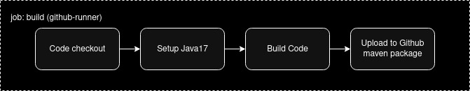
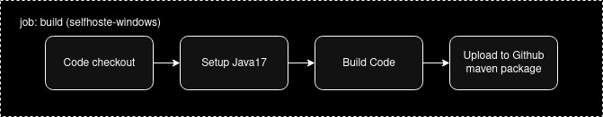
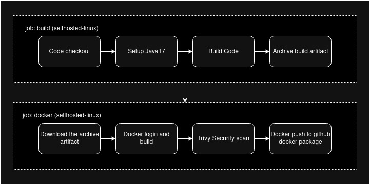
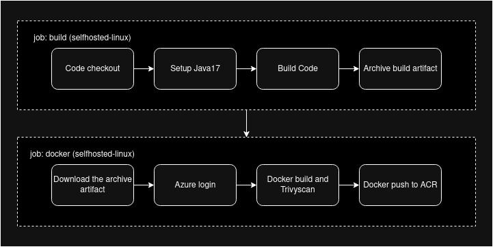
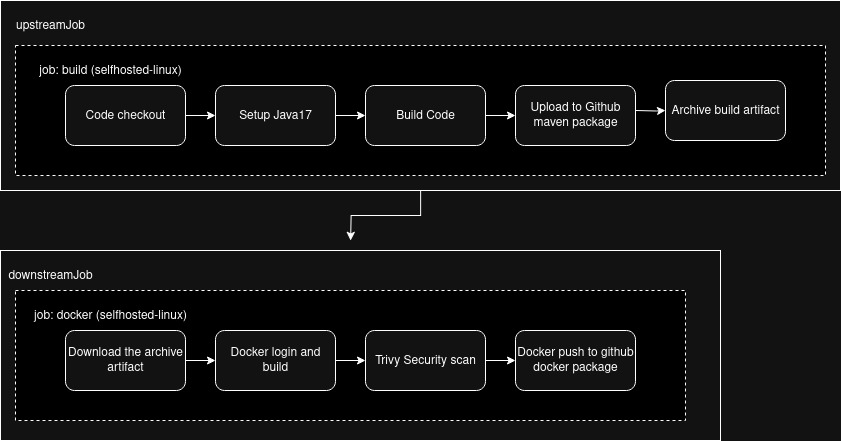

# githubActionsJavaApp

# Github Actions

GitHub Actions is a built-in CI/CD platform available in Gituhub that lets you automate build and deployment. Workflows files are located in .github/workflows directory in this repository.

# Github hosted runner

# Self hosted Runner (Linux)

# Self hosted Runner (Windows)

# Build and Upload package to Nexus repository

# Docker build and push to Github Container Registry

# Docker build and push to Azure Container Registry

# Upstream and Downstream workflows

1. Linux
    -> mkdir actions-runner && cd actions-runner
    -> curl -o actions-runner-linux-x64-2.328.0.tar.gz -L https://github.com/actions/runner/releases/download/v2.328.0/actions-runner-linux-x64-2.328.0.tar.gz
    -> tar xzf ./actions-runner-linux-x64-2.328.0.tar.gz
    -> ./config.sh --url https://github.com/charanaswanth/githubActionsJavaApp --token <<token>>
    -> Add runner group, name and labels
    -> ./run.sh

2. ghcr.io/<OWNER>/<REPO>:<TAG>

