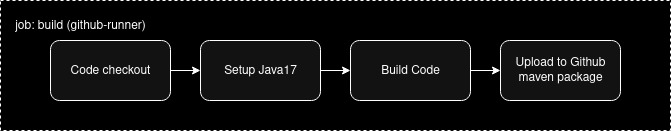
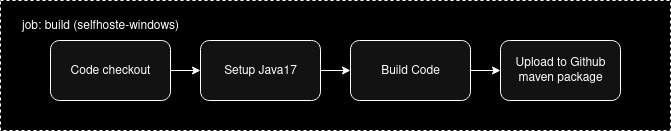
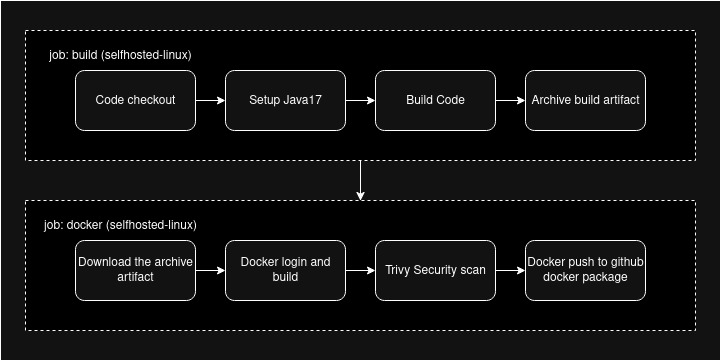
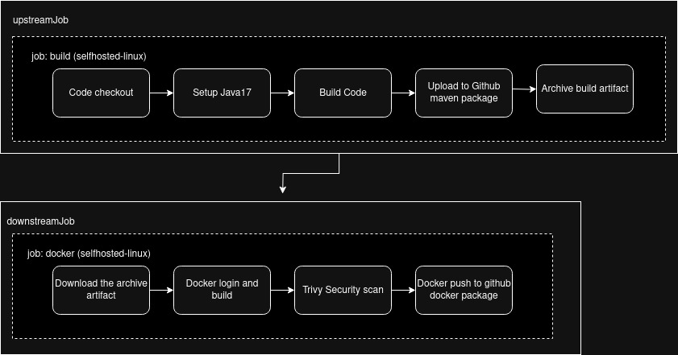

# Github Actions

GitHub Actions is a built-in CI/CD platform available in Gituhub, used to automate build and deployment. Workflow files are located under .github/workflows directory in this repository.

# Github hosted runner

# Self hosted Runner (Linux)

# Self hosted Runner (Windows)

# Build and Upload package to Nexus repository

# Docker build and push to Github Container Registry

# Docker build and push to Azure Container Registry

# Upstream and Downstream workflows
